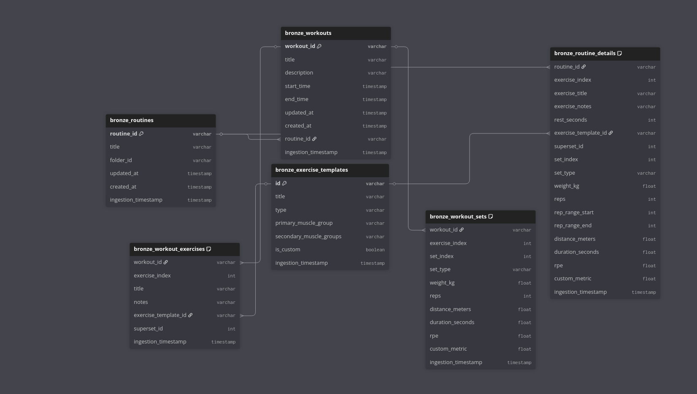
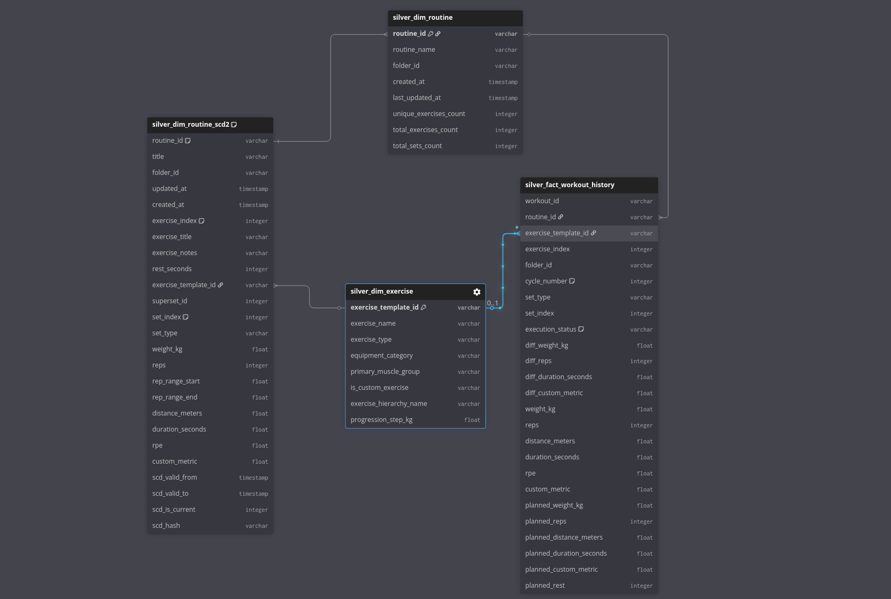
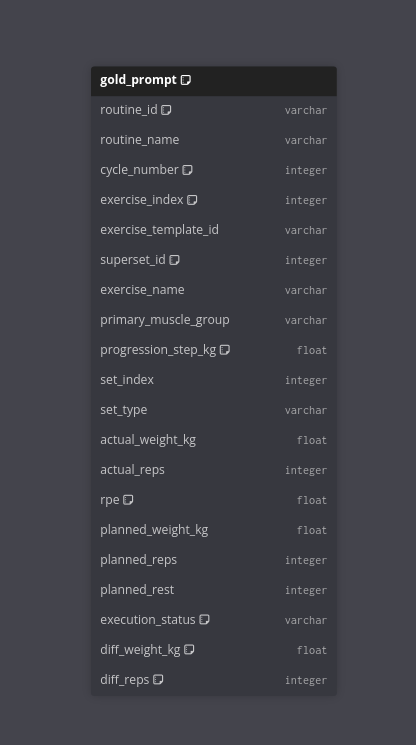

# Hevy_API_AI

**Status:** Active Development / Beta

This repository contains the architecture and codebase for an autonomous workout progression agent. The system integrates the Hevy App API with a Large Language Model (Google Gemini) and a structured local database (SQLite) using a Bronze-Silver-Gold ETL pipeline to automate training planning based on the principles of progressive overload.

## Core Concept

The application functions as a middleware between the user's workout history and the workout tracking platform. It retrieves past performance data, normalizes it through multiple analytical layers, analyzes actual execution against planned metrics, and generates the next scheduled routine via API updates.

## Architecture Overview

The system is designed around a Data Engineering Pipeline and an Analyze-Act loop:

* **1. Data Ingestion & ETL (Bronze, Silver, Gold):**
    * Extracts raw workout logs, routines, and templates from Hevy API.
    * Validates data using strict Pydantic schemas.
    * Transforms and stores data in a structured SQLite database.
    * Implements Slowly Changing Dimensions (SCD2) to track routine history.

* **2. Logic & Inference:**
    * SQL queries aggregate performance, calculating volume, RPE, and historical compliance.
    * Google Gemini receives a context-rich prompt containing the statistical analysis.
    * The LLM evaluates progression steps and generates a JSON-structured workout plan.

* **3. Execution:**
    * Validates the AI-generated JSON against the internal Pydantic schemas.
    * Persists structural data like supersets and rest timers.
    * PUTs the new routine to the user's Hevy account.

## Database Architecture (ETL Pipeline)

The system relies on a local SQLite database governed by strict Python ETL processes. Full database schema definitions and SQL queries are available in [docs/database.sql](docs/database.sql).

### 1. Bronze Layer (Raw Ingestion)

Data is pulled as JSON from the Hevy API, validated against Pydantic definitions ([API Write Docs](docs/post_put_api.md)), and flattened into relational tables. Detailed documentation: [Bronze Schema MD](docs/bronze_schema.md).

### 2. Silver Layer (Dimensional Model)

Data is cleaned and structured into a Star Schema. Slowly Changing Dimensions (SCD2) track routine template alterations over time to accurately compare historical execution against the plan that existed at that exact moment.

### 3. Gold Layer (Prompt Engineering)

A highly denormalized, business-level view optimized specifically to be injected directly into LLM prompts. It pre-calculates the execution status (e.g., 'Overperformed', 'Target Met').

## Tech Stack

* **Language:** Python 3.12+
* **External API:** Hevy API
* **Database:** SQLite (Local Analytics)
* **LLM:** Google Gemini (via google-genai)
* **Data Validation:** Pydantic
* **Interface:** Rich (CLI Dashboard)

## Current Roadmap

- [x] Implement basic Hevy API client (GET/PUT).
- [x] Set up Pydantic schemas for data validation.
- [x] Develop Bronze, Silver, and Gold ETL layers in SQLite.
- [x] Develop the prompt engineering logic for Gemini.
- [x] Create an interactive CLI dashboard using Rich.
- [ ] Implement advanced periodization and custom progression steps.
- [ ] Deploy the solution in a Dockerized environment.
